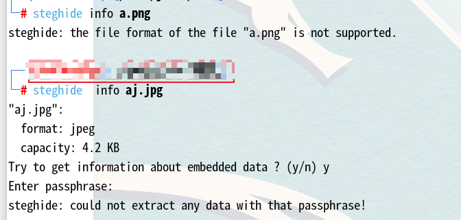

# Dr4g0nB4ll（√）

## nmap扫描

  

## 目录扫描  

  

## web渗透  

  
解码之后是"you find the hidden dir"，提示让我们找隐藏目录  
然后在首页源码界面发现很多行  
  
三层base64解码后是"DRAGON BALL"跟靶场名相对应，或许是目录，访问后看到  
  
访问secret.txt看到是一些目录  

```
cat secret.txt | sed 's|^|http://192.168.25.199/DRAGON%20BALL|' > secrets.txt
```
```
cat secret.txt | sed 's|^|http://192.168.25.199/|' >> secrets.txt
```
使用这两条命令构造链接，然后curl访问，sed 命令中s是替换字符，^是在行首，三条‘|’是等价与‘/’，因为http中有‘/’所以就这样构造  
```
while IFS= read -r url;do curl -o /dev/null -s -w "%{url_effective} http status: %{http_code}\n" "$url";done < secrets.txt
```
+ IFS= 将环境变量置空，防止read读错
+ -o /dev/null 将错误输出扔掉
+ -s 静默访问
+ -w 输出结果
+ %{}是curl的变量，url_effective是有效的url
结果全是404，所以这是一个兔子洞，接着访问Vulnhub目录  
  
  
可能会有图片隐写，先尝试隐写破解  
  
我们可以看到这两种区别可以证明存在隐写，但是红队笔记up的命令格式得到的结果也是这样，跟视频中演示不同  
  
接着使用下面这个工具进行图片隐写密码破解  
```
stegseek aj.jpg /usr/share/wordlists/rockyou.txt
```
  
可以看到生成了私钥，确定之后确实是私钥，然后改回id_rsa文件名，并且将其权限调整为600，否则无法连接  
虽然看到私钥我们能直接想到ssh，但我们没有用户名，还有之前发现的一个login.html，当我尝试注入登录，发现submit点不了，查看源码发现这不是一个form表单但是主页很大一个xmen，或许这是用户名  

## 获得初始shell

然后我门ssh连接-i指定id_rsa即可连接  
  
然后到script显眼包目录里面去，发现有suid权限的文件可以执行  

我们执行之后，查看demo.c文件，很直接就怀疑shell就是.c文件的目标文件  
然后c文件执行了系统命令ps，在这里我们靠经验能够直接想到PATH提权  

## 提权 

  
  

## 总结  

+ /robots.txt都是值得关注的点
+ 主页面源代码的隐藏字符或许不那么容易发现
+ 将xmen作为用户名或许不那么容易想到，调整私钥权限为600或许不容易想起
+ 提权对于经验来说较为简单