# Prime(X)

## nmap扫描

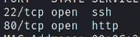

## 目录爆破与模糊测试

```
dirb http://10.10.10.22
```
  
大概可以发现一些目录，还有一个wordpress cms  
接着访问/dev可以看到这样一段话  
  
dirb默认只扫描目录，我们接下来去扫文件  
```
dirb http://10.10.10.22 -X .zip,.txt
```  
多出一个/secret.txt，访问后看到这样一段话，有一个txt文件  
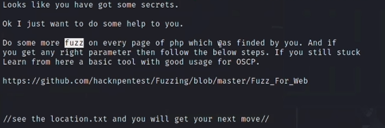  
提示让我们在php文件做fuzz测试，接下来了去扫描php文件，去获得正确的参数  
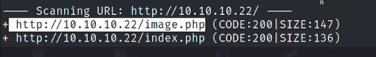  

```
wfuzz -c -w /usr/share/wfuzz/wordlist/genaral/common.txt 
-hh 136 http://10.10.10.22/index.php?FUZZ=xxx
```
-hh是根据字符长度来进行过滤，-hc根据状态码过滤，最终得到这个结果  
  
然后我们用这个参数去访问location.txt，index.php?file=location.txt，它让我们通过新参数访问  
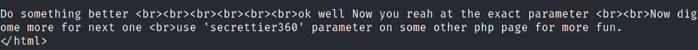  
接下来我们访问index.php?secrettier360= 访问没有反馈，我们就尝试之前发现的其他php文件，image.php  
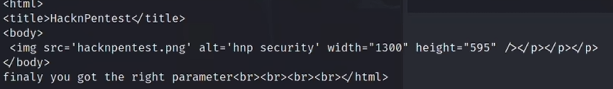  

## 文件包含利用

接下来我们通过这个参数尝试读取文件/etc/passwd，就能看到很明显的提示  
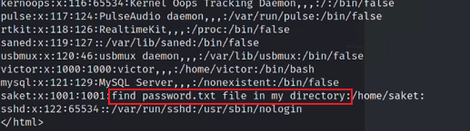  
然后访问之后得到一个密码字符串follow_the_ippsec，我们可以尝试22端口，和之前发现的wordpress cms登录  
22端口利用失败，接下来我们尝试用wpscan扫描cms  
```
wpscan --url http://10.10.10.22/wordpress -e u --api-token=...
```
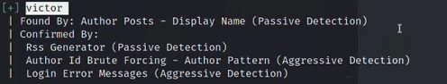  
然后和刚才的密码尝试，成功登录  

## wordpress后台利用

进入后台之后无非就是插件漏洞，主题漏洞的利用，然后我们在主题编辑器这里发现了可写php代码的地方  
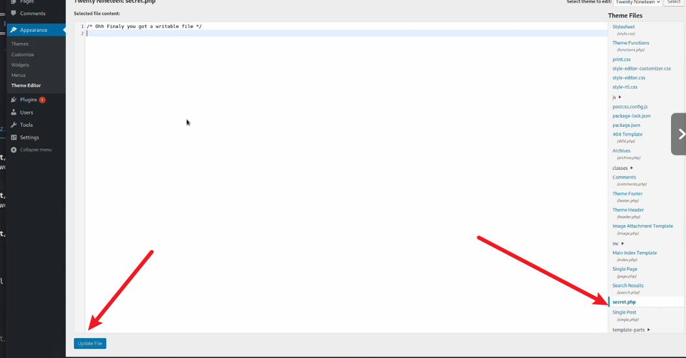  
然后写入php代码，访问对于文件，执行反弹shell  
  


## 获得初始shell

### 方法1

我们首先发现了这个文件，但这个留着方法2利用  
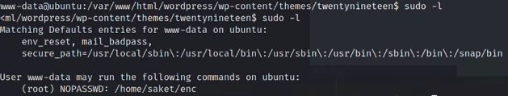  
然后我们uname -a能够发现linux版本比较低，应该会有漏洞提权  
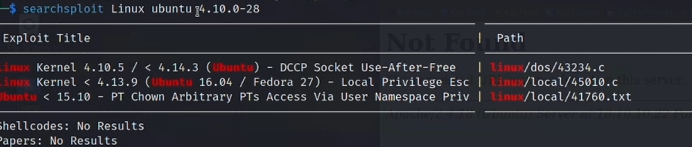  
接下来利用这个.c文件，我们在kali上编译之后，在靶机上不能执行，然后在靶机上的gcc编译即可执行成功  
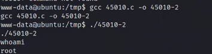  

### 方法2

