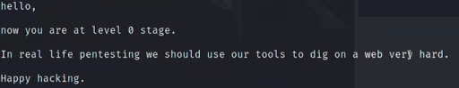

# Prime(X)

## nmap扫描


## 目录爆破与模糊测试

```
dirb http://10.10.10.22
```
  
大概可以发现一些目录，还有一个wordpress cms  
接着访问/dev可以看到这样一段话  
  
dirb默认只扫描目录，我们接下来去扫文件  
```
dirb http://10.10.10.22 -X .zip,.txt
```  
多出一个/secret.txt，访问后看到这样一段话，有一个txt文件  
  
提示让我们在php文件做fuzz测试，接下来了去扫描php文件，去获得正确的参数  
  

```
wfuzz -c -w /usr/share/wfuzz/wordlist/genaral/common.txt 
-hh 136 http://10.10.10.22/index.php?FUZZ=xxx
```
-hh是根据字符长度来进行过滤，-hc根据状态码过滤，最终得到这个结果  
  
然后我们用这个参数去访问location.txt，index.php?file=location.txt，它让我们通过新参数访问  
  
接下来我们访问index.php?secrettier360= 访问没有反馈，我们就尝试之前发现的其他php文件，image.php  
  

## 文件包含利用

接下来我们通过这个参数尝试读取文件/etc/passwd，就能看到很明显的提示  
  
然后访问之后得到一个密码字符串follow_the_ippsec，我们可以尝试22端口，和之前发现的wordpress cms登录  
22端口利用失败，接下来我们尝试用wpscan扫描cms  
```
wpscan --url http://10.10.10.22/wordpress -e u --api-token=...
```
  
然后和刚才的密码尝试，成功登录  

## wordpress后台利用获得初始shell

进入后台之后无非就是插件漏洞，主题漏洞的利用，然后我们在主题编辑器这里发现了可写php代码的地方  
  
然后写入php代码，访问对于文件，执行反弹shell  
  


## 提权

### 方法1

我们首先发现了这个文件，但这个留着方法2利用  
  
然后我们uname -a能够发现linux版本比较低，应该会有漏洞提权  
  
接下来利用这个.c文件，我们在kali上编译之后，在靶机上不能执行，然后在靶机上的gcc编译即可执行成功  
  

### 方法2

#### enc查找与破解

还记得我们之前提到的enc利用,如果对openssl加密熟悉的话，能够认出来enc加密  
  
可以执行，但是需要密码，我们接下来需要去寻找密码，可以使用find  
```
find / -name '*pass*' 2>/dev/null | sort | less
```
```
find / -name '*backup*' 2>dev/null | sort | less
```
sort是对结果进行排序，less是分屏显示，都是方便我们查看，下面就是我们找到的亮眼的结果  
  
我们查看这个文件，看到刚好和enc有关系  
  

#### MD5格式生成

当我们用密码执行这个文件之后，并没有提权，但是提示了我们good，这说明命令是成功执行的，同时enc当前目录下生成了两个文件  
  
然后根据提示对‘ippsec’进行md5格式加密  
```
echo -n 'ippsec' | md5sum | awk -F '' '{print $1}'
```
-n是不输出结尾的换行符，awk是对字符串进行一个筛选，然后就得到了md5字符串  

#### openssl破解语句

构造原始的命令，后面还会修改  
```
echo -n 'enc.txt里的加密字符串' openssl enc -d -a -CipherType -K [md5字符串]
```
enc 表示对文件进行对称加密或解密，-d表示对字符串进行解密操作，-a表示base64解码，-CipherType表示加解密类型，-K就是密钥  
  
根据经验能看出加密类型，但是没有经验就需要像接下来这样，openssl --help查看加密类型，然后将其复制粘贴到一个文件中(CipherTypeRaw)，接下来需要筛选过滤  
```
cat CipherTypeRaw | awk '{gsub(/ /,"\n");print}' | sort | uniq > CipherTypes
```
awk进行的操作是将空格替换成换行符并且打印，sort进行排序，uniq是输出唯一字符，当有重复字符出现时，因为之前有很多空格替换成换行，然后我们可以wc -l 进行计算行数，当然也可以不这样做  
  
前面的-K参数我们使用openssl enc --help查看，这个key是需要原始数据，十六进制格式，所以接下来还需要进行一些处理  

  
od是一个linux自带的工具，文件格式转八进制的这么一个工具，当然也可以转其他进制，-A是一个必须的参数，n是none，-t指定转存类型x1就是十六进制，然后可以看到结果有0a，这是换行符导致多出的结果  
然后我们tr -d '\n' 去掉换行符，再次tr -d '\n'让其变成一行，tr -d ' '让其连在一起  
```
echo -n 'ippsec' | md5sum | awk -F ' ' '{print $1}' | tr -d '\n' |od -A n -t x1 | tr -d '\n' | tr -d ' '
```

#### for循环执行破解

现在我们就可以继续之前的openssl破解，因为我们没经验不能识别加密类型，所以需要配合之前的ciphertype文件进行一个循环遍历  
```
for Cipher in $(cat CipherTypes);do echo 'enc.txt里的加密字符串' openssl enc -d -a -$Cipher -K [md5字符串] 2>/dev/null ;done
```
现在这条语句我们可以发现echo没有-n，这是openssl的一个bug，如果加密字符串中有换行符就不能echo -n否则就解不出来  
  
根据key.txt的提示我们可以猜测这是否是saket账户的密码，然后ssh登录  
  
可以看到可以执行这个文件，并且会执行这些命令,/tmp目录下并没有challenge文件，很简单就创建一个，写进/bin/bash提权root。  

## 总结

+ 获得初始shell就是根据提示进行操作，然后cms反弹shell
+ 第二中提权方法相对困难，有find查找enc执行密码
+ 然后根据enc生成的文件去使用openssl解密获得saket密码
+ 然后就是简单的sudo提权
+ 工具方面有openssl，awk，od等