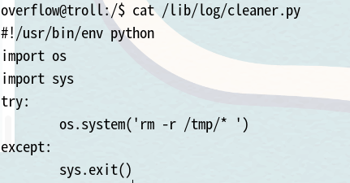

# Tr0ll （√）

## namp扫描  

```
PORT   STATE SERVICE VERSION
21/tcp open  ftp     vsftpd 3.0.2
22/tcp open  ssh     OpenSSH 6.6.1p1 Ubuntu 2ubuntu2 (Ubuntu Linux; protocol 2.0)
80/tcp open  http    Apache httpd 2.4.7 ((Ubuntu))
MAC Address: 00:0C:29:A6:86:AA (VMware)
Service Info: OSs: Unix, Linux; CPE: cpe:/o:linux:linux_kernel
```
```
PORT   STATE SERVICE
21/tcp open  ftp
| ftp-anon: Anonymous FTP login allowed (FTP code 230)
|_-rwxrwxrwx    1 1000     0            8068 Aug 09  2014 lol.pcap [NSE: writeable]
| ftp-syst: 
|   STAT: 
| FTP server status:
|      Connected to 192.168.25.6
|      Logged in as ftp
|      TYPE: ASCII
|      No session bandwidth limit
|      Session timeout in seconds is 600
|      Control connection is plain text
|      Data connections will be plain text
|      At session startup, client count was 1
|      vsFTPd 3.0.2 - secure, fast, stable
|_End of status
MAC Address: 00:0C:29:A6:86:AA (VMware)
```

## ftp渗透

  
可以看到只有一个pcap文件，这是一个网络包文件，下载下来用windows下的wireshark分析  
  
发现一个txt文件，内容好像如下  
```
Well, well, well, aren't you just a clever little devil, you almost found the sup3rs3cr3tdirlol :-P

Sucks, you were so close... gotta TRY HARDER!
```


## 目录扫描  

  

## web渗透  

主页是hacker.jpg，/secret目录下是一张更大的图片troll.jpg  
从ftp发现的字符串，可能是个目录，访问之后发现新文件  
  
这是一个elf可执行文件，执行之后显示这个  
  
有点看不懂什么意思，查找什么地址？知识盲区了。up主使用strings roflmao进行查看这个文件会有哪些字符串，最终都是看到这个信息，然后这个是web目录地址可以访问，我还以为这个靶机的难度涉及到内存哪些  
  
然后将这些目录里有的文件进行下载，是这些内容  
  
22端口开放了的，那么我猜测这些可能是账户和密码，用hydra进行尝试，再用crackmapexec进行尝试，以便熟悉crackmapexec，在我的尝试下ftp和ssh都是无效的，又卡住了！！！然后就看视频，下面这个点是关于crackmapexec的使用，虽然密码和账户暂时都无效，但还是有用的。  
```
crackmapexec ssh 192.168.25.11 -u which_one_lol.txt -p Pass.txt --continue-on-success
```
--continue-on-success是即使成功了继续爆破，根据结果显示可以看见靶机对ssh爆破进行了限制，然后就将数据进行对调，但是还是没有结果  
然后up很聪明，那个目录说的是“这个目录有密码”，既然文件内容不是密码，那可能文件名就是密码  

## 提权  

最后得到的结果是overflow:Pass.txt，尝试连接  
查看内核版本3.13.0，搜索漏洞刚好有这个完全对应的版本，而且刚好是ubuntu，37292.c
  
  
最后成功提权，还有这个靶机ssh有点小毛病，在一定时间之后会断开连接，最初我以为这是靶机设的防护，像防止ssh爆破那样，结果up的分析是有自动任务正在执行，内核漏洞提权是最不先考虑的，那我为什么要内核提权呢，因为我菜，查看/etc/crontab告诉我们权限不允许，那么这个任务计划是有问题的，我就找/etc/corn*,结果还是不知道哪个是目标，就放弃了这一条路，没想到内核直接提权成功了  

## 任务计划提权  
接下来是视频里的操作，因为确定了有任务计划，那么我们就想到去寻找任务计划日志  
  
  
  
  
  
看到执行的命令是这个，怪不得我之前传exp到tmp目录下时很奇怪，给我整不会了，明明显示下载成功，但是却看到没有文件，还是那条语句  
```
echo "overflow ALL=(ALL)NOPASSWD:ALL" >> /etc/sudoers
```
  
仍然是成功提权  

## 总结  

1. 在发现0x0856BF时，我以为是内存地址什么的，还以为上难度了，就没尝试web目录
2. 在密码喷射时也很难想到那个文件名就是密码，这样的设计我只能说是歪门邪道
3. 虽然我内核漏洞提权成功了，但是up的寻找cronlog又是一条新思路 